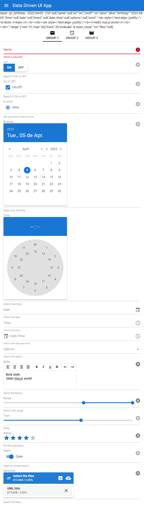

# Data Driven Dynamic UI Generation with Vue.js and Quasar


## Description

In mid-March/2020 we started a first attempt at dynamic UI generation, based on a schema definitions in JSON (**Data Driven UI**) using the frameworks **Vue.js + Quasar**.

The **Data Driven UI** concept allows interesting solutions such as:

- Define UI model definition schema related to database tables and views that generates UI dynamically;
- Create the UI model definition schema agnostic to technologies and frameworks (one can develop a generator for **Vue+Quasar**, another in **React+Material UI**, and so on).

The idea was to link to the database schema API, an API that provides UI definitions for forms related to tables and views (entities) in the database. These UI definitions would be structured in JSON format and a client-side interpreter would generate the UI based on JSON information (at that time in **Vue.js 2.0 + Quasar framework 1.0**).

The dynamically generated form would present a field definition schema for each corresponding entity field in the database with the type of edit control component (and other relevant properties) for the field. These controls would be rendered one below the other or within groups (tabs, cards, expansions, and so on). The scheme also provided lookup fields related to their dependencies on each other (_eg countries, states, cities_). The edit controls are based on the **_Quasar Framework's form controls_** with some tweaks such as the use of **_event bus_** for event communication and **_scoped slots_** for property communication between the form, edit controls and the wrapper component. Some complex component compositions using slots in the JSON schema were also implemented. A **_renderless wrapper component_** was also provided for interaction with the RESTful/GraphQL API to interact with the data of the corresponding entity / lookups in the database.

For reasons of simplicity, most features were excluded from the original code to focus only on dynamic rendering of the main components, i.e. form, groups and edit controls (_which is the focus of this article_). We only kept the implementation of forms with the fields grouped in tabs.

## Pre-requisites

We assume you have a good knowledge of **git cli**, **javascript**, **Vue.js** and **Quasar Framework**. You must have **Vue cli** and **quasar cli** installed on your system. This tutorial was run in a **_linux environment_**, but you would easily tweak this for your preferred operating system.

## The JSON schema structure

The JSON structure is fairly simple. Define the groups and list of fields in each group item.

However, defining field properties can be as complex as supported Quasar UI controls allow (_to find out which properties are supported, see the documentation for the corresponding **Quasar** control_).

The field properties in the schema allow you to define validation rules on the value entered for the field, editing mask, many visual aspects and much more.

The JSON structure is as follows:

- **_groupModel: string_** => (Only 'tab' is currently supported);
- **_groups: array_** => array of group itens:
  - Main group properties (**_name, label, icon_**);
  - Other optional group control type specific properties
  - **_fields: array_** => UI controls definition list for fields:
    - Main field properties (**_name, id, fieldType_**);
    - Other optional field control type specific properties.

Below is an example of a JSON schema used in this article:

```javascript
export default {
  /*
   * Group type: Only 'tab' is currently supported
   */
  groupModel: "tab",
  /*
   * List of group itens
   */
  groups: [
    {
      /*
       * Main properties (name, label, icon)
       */
      name: "Group 1",
      label: "Group 1",
      icon: "mail",

      /*
       * Control type specific properties
       */
      flat: true,
      "expand-separator": true,

      /*
           * Field list: name, id and fieldType 
             are the main properties, the others are 
             UI control specific properties.
           */
      fields: [
        {
          /*
           * Main field properties
           */
          name: "id",
          id: "g1_id",
          fieldType: "inputtext",
          /*
           * Control type specific properties
           */
          label: "id",
          dense: false,
          readonly: true,
          hidden: true,
        },
        /*
         * Other fields definitions...
         */
        {
          name: "name",
          id: "g1_name",
          fieldType: "inputtext",
          label: "Name",
          placeholder: "Name...",
          hint: "Inform the name...",
          dense: true,
          clearable: true,
          "clear-icon": "close",
          /*
           * Validation rules can be defined as in the example below
           */
          rules: [
            {
              params: ["val"],
              exp: '!!val || "Name is required!"',
            },
          ],
        },
        {
          name: "on",
          id: "g1_on",
          fieldType: "btntoggle",
          label: "On?",
          hint: "Report if ON or OFF...",
          dense: false,
          clearable: true,
          "stack-label": true,
          filled: false,
          options: [
            { label: "On", value: "on" },
            { label: "Off", value: "off" },
          ],
        },
        {
          name: "onoff",
          id: "g1_onoff",
          fieldType: "checkbox",
          "outer-label": "On or Off?",
          label: "On/Off",
          hint: "Report if ON or OFF...",
          "indeterminate-value": null,
          "true-value": "on",
          "false-value": "off",
          dense: false,
          clearable: true,
          "stack-label": true,
          filled: false,
        },
        {
          name: "alive",
          id: "g1_alive",
          fieldType: "radio",
          "outer-label": "Is alive?",
          label: "Alive",
          hint: "let me know if you're alive...",
          val: "alive",
          dense: false,
          clearable: true,
          "stack-label": true,
          filled: false,
        },
        {
          name: "birthday",
          id: "g1_birthday",
          fieldType: "datepicker",
          label: "Birthday",
          hint: "enter your birthday...",
          mask: "YYYY-MM-DD",
          titleFormat: "ddd., DD [de] MMM.",
          dense: false,
          clearable: true,
          "stack-label": true,
          filled: false,
        },
        {
          name: "time",
          id: "g1_time",
          fieldType: "timepicker",
          label: "Time",
          hint: "Inform the time...",
          format24h: true,
          dense: false,
          clearable: true,
          "stack-label": true,
          filled: false,
        },
        {
          name: "date",
          id: "g1_date",
          fieldType: "inputdate",
          label: "Date",
          placeholder: "Date...",
          dateMask: "DD/MM/YYYY",
          mask: "##/##/####",
          hint: "Inform the date...",
          titleFormat: "ddd., DD [de] MMM.",
          dense: true,
          clearable: true,
        },
        {
          name: "time2",
          id: "g1_time2",
          fieldType: "inputtime",
          label: "Time",
          placeholder: "Time...",
          timeMask: "HH:mm:ss",
          mask: "##:##:##",
          hint: "Inform the time...",
          format24h: true,
          withSeconds: true,
          dense: true,
          clearable: true,
        },
        {
          name: "date_time",
          id: "g1_date_time",
          fieldType: "inputdatetime",
          label: "Date/Time",
          placeholder: "Date/Time...",
          dateMask: "DD/MM/YYYY HH:mm:ss",
          mask: "##/##/#### ##:##:##",
          hint: "Inform the date and time...",
          dateTitleFormat: "ddd., DD [de] MMM.",
          format24h: true,
          withSeconds: true,
          dense: true,
          clearable: true,
        },
        {
          name: "options",
          id: "g1_options",
          fieldType: "select",
          label: "Options",
          hint: "Inform the option...",
          dense: true,
          clearable: true,
          transitionShow: "flip-up",
          transitionHide: "flip-down",
          options: ["Google", "Facebook", "Twitter", "Apple", "Oracle"],
        },
        {
          name: "word",
          id: "g1_word",
          fieldType: "editor",
          label: "Editor",
          hint: "Spills the beans...",
          clearable: true,
          "stack-label": true,
          "min-height": "5rem",
        },
        {
          name: "range",
          id: "g1_range",
          fieldType: "range",
          outerLabel: "Range",
          hint: "Inform the range...",
          clearable: true,
          "stack-label": true,
          min: 0,
          max: 50,
          label: true,
        },
        {
          name: "track",
          id: "g1_track",
          fieldType: "slider",
          outerLabel: "Track",
          hint: "Drag...",
          clearable: true,
          "stack-label": true,
          min: 0,
          max: 50,
          step: 5,
          label: true,
        },
        {
          name: "evaluate",
          id: "g1_evaluate",
          fieldType: "rating",
          label: "Rating",
          hint: "Do the evaluation...",
          clearable: true,
          "stack-label": true,
          max: 5,
          size: "2em",
          color: "primary",
        },
        {
          name: "open_close",
          id: "g1_open_close",
          fieldType: "toggle",
          "outer-label": "Open?",
          label: "Open",
          hint: "Open or closed report...",
          dense: false,
          clearable: true,
          "stack-label": true,
          filled: false,
          color: "primary",
          "true-value": "on",
          "false-value": "off",
        },
        {
          name: "files",
          id: "g1_files",
          fieldType: "uploader",
          "outer-label": "Send files",
          label: "Select the files",
          hint: "Select the files...",
          dense: false,
          clearable: true,
          multiple: true,
          "stack-label": true,
        },
      ],
    },
    {
      name: "Group 2",
      label: "Group 2",
      icon: "alarm",

      flat: true,
      "expand-separator": true,
    },
    {
      name: "Group 3",
      label: "Group 3",
      icon: "movie",

      flat: true,
      "expand-separator": true,
    },
  ],
};
```

## How the magic happens

### The resources needed in the framework

For the thing to work the framework would have to support the possibility to create components dynamically, conditionally and also support iteration over an array of definitions. Fortunately **Vue.js** is very good at these things!

**Vue.js** suports [**Conditional Rendering - (v-if/v-else/v-else-if)**](https://vuejs.org/guide/essentials/conditional.html), and [**List Rendering - (v-for)**](https://vuejs.org/guide/essentials/list.html). These features allow you to iterate over the JSON schema and conditionally render the UI components.

Conditional rerendering is ok for a few types of controls, but not the best option when you have a lot of them (_in this article we've defined about **20 different** types of form controls as bonus for you!_)

For this type of challenge **Vue.js** supports [**dynamic component creation - (:is)**](https://v2.vuejs.org/v2/guide/components-dynamic-async.html). This feature allows you to reference dynamically imported component instance.

Also remember the section above where we mentioned that each control type has its different set of properties. For the thing to work, **Vue.js** would need to allow linking all the properties of an object in batch. And once again Vue.js has the solution for this: [**Passing all properties of an Object - (v-bind)**](https://v2.vuejs.org/v2/guide/components-props.html#Passing-the-Properties-of-an-Object).

In the section below we will see how all the features above will be used inside the `template` section of **FormGenerator.vue**
to create a clean and concise solution to the problem.

### The component infrastructure

The **_src/components_** folder has a series of source codes. Let's analyze them to understand how the whole thing was implemented:

#### **\_compoenentMap01.js**

This [**mixin object**](https://v2.vuejs.org/v2/guide/mixins.html?redirect=true) is injected into the **FormGenerator.vue**. Its function is to provide a data dictionary (**componentMap[]**) in which each component name resolves to a factory that dynamically imports and returns the component instance for that name:

```javascript
/**
 * A mixin object that mantain a dictionary de components
 */

export default {
  data() {
    return {
      componentMap: {},
    };
  },
  methods: {
    initComponentsMap() {
      this.componentMap = {
        // Group components
        card: () => import("./Card01"),
        tabs: () => import("./Tabs01"),
        tab: () => import("./Tab01"),
        tabpanel: () => import("./TabPanel01"),
        expansion: () => import("./Expansion01"),

        // Form component
        form: () => import("./Form01"),

        // From field components
        inputtext: () => import("./Input01"),
        inputdate: () => import("./DateInput01"),
        inputtime: () => import("./TimeInput01"),
        inputdatetime: () => import("./DateTimeInput01"),
        select: () => import("./Select01"),
        checkbox: () => import("./CheckBox01"),
        radio: () => import("./Radio01"),
        toggle: () => import("./Toggle01"),
        btntoggle: () => import("./ButtonToggle01"),
        optgroup: () => import("./OptionGroup01"),
        range: () => import("./Range01"),
        slider: () => import("./Slider01"),
        datepicker: () => import("./DatePicker01"),
        timepicker: () => import("./TimePicker01"),
        rating: () => import("./Rating01"),
        uploader: () => import("./Uploader01"),
        editor: () => import("./Editor01"),

        // Other
        icon: () => import("./Icon01"),
      };
    },
  },
};
```

Afterwards the dictionary is used to create dynamic components in the `template` by their name as:

```html
<!-- Create a dynamica TABS type component -->
<component :is="componentMap['tabs']"></component>
```

#### **FormGenerator.vue**

This one does the bulk of the work to dynamically assemble the UI based on the JSON schema.

It has a series of functions for internal services, so let's focus on the part that really matters.

- First it imports the componetMap so that it can be injected as a mixin and accessible in the template;
- Create and provide an event bus to communicate with the component ecosystem;
- Defines the property that will receive the JSON schema;
- Defines the formData data to maintain the input field contents.

```javascript

...

import componentMap from "./_componentMap01";

...

export default {
  name: "FormGenerator",

  mixins: [componentMap],

  provide() {
    return {
      // The event bus to comunicate with components
      eventBus: this.eventBus,
    };
  },
  props: {
    // The schema placeholder property
    schema: {
      type: Object,
    },
  },
  data() {
    return {
      // The event bus instance
      eventBus: new Vue(),
...
      // Form data with input field contents
      formData: {},
...
    }
  }

...

}
```

And finally the `template` that creates the dynamic components - the comments in the template clearly explain how the **Vue.js** features work together to make the thing work:

```html
<template>
  <!--
        Dynamic wrapper `form` component
        `fixedSchema` is the ajusted version of property `schema`
      -->
  <component v-if="fixedSchema" :is="componentMap['form']" ref="form">
    <!--
        ==================  
        Groups with fields
        ==================
        -->
    <div v-if="fixedSchema.groups && fixedSchema.groups.length > 0">
      <!--
          ==========
          TAB Model
          ==========
          -->
      <!--
            Dynamic `tabs` component
          -->
      <component
        v-if="fixedSchema.groupModel == 'tab'"
        :is="componentMap['tabs']"
        v-model="selectedGroup"
        dense
      >
        <!--
              Dynamic `tab itens` components  
            -->
        <component
          v-for="(group, index) in fixedSchema.groups"
          :is="componentMap['tab']"
          :key="index"
          v-bind="group"
        >
        </component>
      </component>

      <q-separator />

      <!--
            Dynamic `tabpanel` component
          -->
      <component
        v-for="(group, index) in fixedSchema.groups"
        :is="componentMap['tabpanel']"
        :key="index"
        :selected="selectedGroup"
        v-bind="group"
      >
        <div v-if="group.fields && group.fields.length > 0">
          <!--
                And finally all UI field controls:
                - Component type specified by `componentMap[field.fieldType]`
                - Data contents linked to `formData[field.name]` by `v-model`
                - All `field` properties linked by `v-bind`
              -->
          <component
            v-for="(field, index) in validFieldComps(group.fields)"
            :key="index"
            :is="componentMap[field.fieldType]"
            v-model="formData[field.name]"
            v-bind="field"
            v-show="!field.hidden"
          >
          </component>
        </div>
      </component>
    </div>
  </component>
</template>
```

#### **The other ".vue" files in /src/components**

The other components basically encapsulate one or more of the original **Quasar Components** to deliver the desired functionality. They pass the events back to **FormGenerator.vue** via its `event bus` and receive event handlers and data from parent by means `v-on="$listners"` and `v-bind="$attrs"`.

As an example we have the following source code from **input.vue**:

```javascript
<template>
  <q-input
    v-bind="$attrs"
    v-on="$listeners"
    @input="onInput"
    @clear="onClear"
    @focus="onFocus"
    @blur="onBlur"
  >
    <template
      v-for="(_, slot) of $scopedSlots"
      v-slot:[slot]="scope"
    >
      <slot
        :name="slot"
        v-bind="scope"
      />
    </template>
  </q-input>
</template>

<script>
import compInfo from './_compInfo'

export default {
  mixins: [compInfo],
  inject: ['eventBus'],
  methods: {
    onInput (value) {
      this.eventBus.$emit('input', this, value)
    },
    onClear (value) {
      this.eventBus.$emit('clear', this, value)
    },
    onFocus (evt) {
      this.eventBus.$emit('focus', this, evt)
    },
    onBlur (evt) {
      this.eventBus.$emit('blur', this, evt)
    }
  },
  inheritAttrs: false
}
</script>
```

### How to use the FormGenerator

Now comes the easy part, in `src/pages/FormTest.vue` we have the page that loads a JSON Schema and passes it to **FormGenerator** component - and that's all!

```javascript
<template>
  <form-generator :schema="schema" />
</template>

<script>
import FormGenerator from "../components/FormGenerator";
import jsonSchema from "../data/schema.js";

export default {
  components: { FormGenerator },
  data() {
    return {
      schema: {},
    };
  },
  created() {
    this.schema = jsonSchema;
  },
};
</script>
```

By running the example with the command below:

```bash
# Run the Quasar/Vue application
$ yarn quasar dev
```

and then enter the following URL in your preferred browser:

**_http://localhost:8080_**

You get this impressive result:



## Running the example from this tutorial

### Installation

```bash
# Clone tutorial repository
$ git clone https://github.com/maceto2016/VueDataDrivenUI

# access the project folder through the terminal
$ cd VueDataDrivenUI

# Install dependencies
$ npm install
```

### Running the application (from NestJSDynLoad folder)

```bash
# Run the Quasar/Vue application
$ yarn quasar dev
```

### Testing the application

Enter the following URL in your preferred browser

**_http://localhost:8080_**

## Conclusion

In this article we present the concept of **Data Driven UI**, which is nothing more than the dynamic creation of a UI based on the information present in a definition data. The article demonstrated how easy it is to define a **JSON Schema** and create an infrastructure using the **Vue.js + Quasar frameworks** to dynamically create components. As a **bonus** we provide about **20 UI components** based on the **Quasar framework UI** components.

Feel free to use the source code and ideas presented here. There is huge room for improvement including migration to **Vue.js 3, Quasar 2 and Typescript**. Now it's up to you!

I thank you for reading. I would be happy to hear your feedback!
